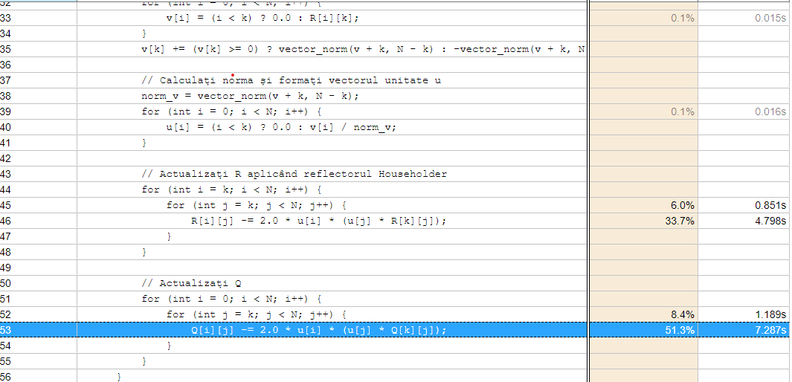
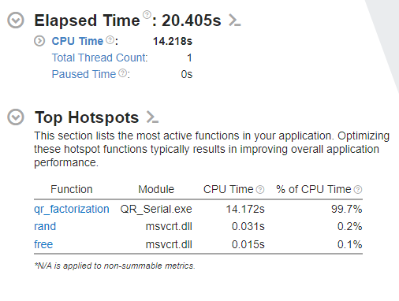

# Factorizarea QR

Acest proiect utilizează Intel VTune Profiler pentru analiza performanțelor factorizarilor QR folosind reflectorii Householder.

---

## Analiza Performanței

### Timpul pe Funcții
Analiza timpilor pentru fiecare funcție din aplicație, evidențiind zonele de optimizare.

---

### Timpul Total și Hotspots
Timpul total al execuției și funcțiile care utilizează cel mai mult CPU.

---

## Descriere
- Factorizarea QR a fost analizată pentru a identifica zonele critice ale performanței.
- Rezultatele arată distribuția utilizării CPU și oportunități pentru paralelizare sau optimizare.

Proiect realizat pentru explorarea factorizării QR și evaluarea performanței folosind Intel VTune Profiler.